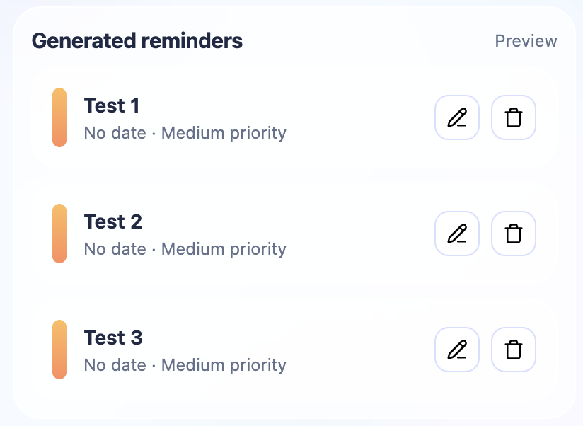
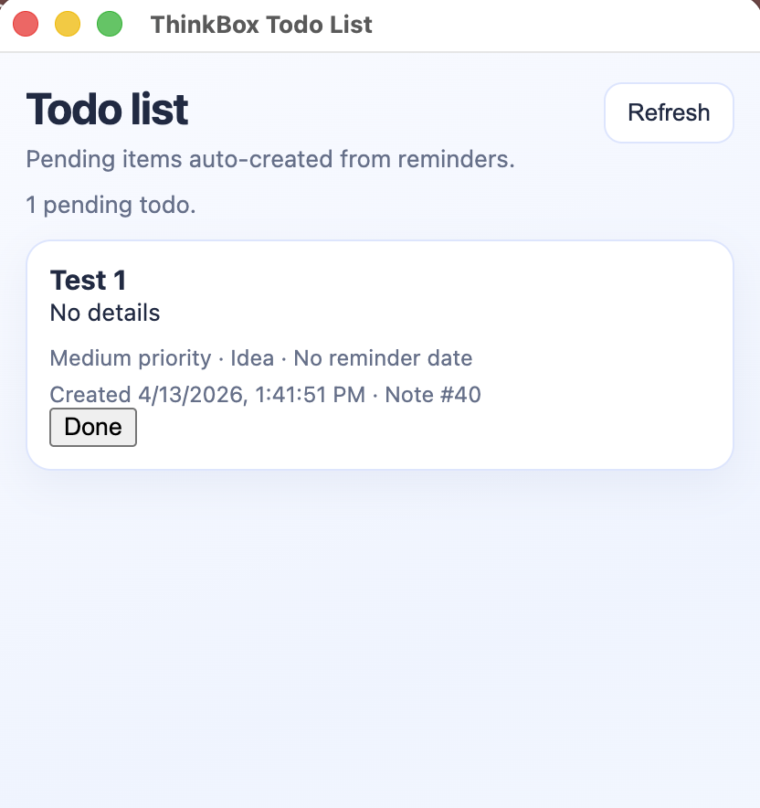

# ThinkBox

ThinkBox is a local-first desktop app that turns fast, messy notes into structured reminders and todos.

Built for people who think quickly and do not want to lose useful thoughts during work, study, or daily life.


-success)


## Why I Built This

I kept having the same issue every day: small but important thoughts appeared while I was in the middle of something else, and by the time I finished, they were gone.

ThinkBox started as a personal tool to solve that exact pain. I wanted:

- A place to capture notes instantly
- Zero cloud dependency
- Automatic cleanup of chaotic notes into actionable reminders
- A simple daily flow that feels lightweight

So now I can dump thoughts quickly, then let the app organize them into categories, priority levels, and reminders when I am ready.

## What ThinkBox Does

- Captures notes quickly in a desktop-first UI
- Stores everything locally in SQLite
- Uses a local model (`qwen2.5:3b`) via Ollama to classify notes
- Generates structured reminders with title, detail, date, and priority
- Shows pending todos in a dedicated todo window
- Lets you edit and delete notes and reminders anytime

## How It Works

1. You write quick notes during the day.
2. Notes are saved in the local database (`thinkbox.db`).
3. When you click generate, ThinkBox sends each unprocessed note to the local model.
4. The model returns structured JSON.
5. ThinkBox saves reminders and surfaces todo items in a focused list.

No cloud APIs. No external data sharing. Just local processing.

## Screenshots

### 1) Capture Fast

The main window is built for quick thought capture: type, save, move on.


### 2) Turn Notes Into Reminders

Generated reminders are structured with category, priority, and date so review is simple.



### 3) Focus on What Is Pending

The todo window gives a clean, dedicated view of open tasks so you can close the day with clarity.



## Tech Stack

- Electron Forge + Vite
- TypeScript
- SQLite (`sqlite` + `sqlite3`)
- Ollama local runtime
- Local model: `qwen2.5:3b`

## Project Structure

```text
.
|- src/
|  |- main.ts            # Electron main process + IPC handlers
|  |- preload.ts         # Secure renderer bridge
|  |- renderer.ts        # Main window UI logic
|  |- todosRenderer.ts   # Todo window UI logic
|  |- assets/notePrompt.txt
|- db/dbIndex.ts         # DB init + migrations
|- scripts/
|  |- aiScript.ts        # Note classification flow
|  |- modelStuff.ts      # Ollama runtime management
|- docs/screenshots/     # Place README screenshots here
```

## Getting Started

### Prerequisites

- Node.js 18+ (20+ recommended)
- npm
- Ollama installed and available in your shell (`ollama`)
- Model pulled locally:

```bash
ollama pull qwen2.5:3b
```

### Installation

```bash
npm install
```

### Run in Development

```bash
npm start
```

### Optional Commands

```bash
npm run lint
npm run package
npm run make
```

## Local Data and Privacy

- Database file: `thinkbox.db`
- Location: Electron `userData` directory
- Processing: local only
- Model runtime: local Ollama server (`127.0.0.1:11434`)

ThinkBox is designed to keep your notes on your machine.

## Current State

This is an actively evolving v1.

Current focus:

- Fast capture flow
- Strong local-first reminder generation
- Better todo review experience

Planned improvements include UI polish, deeper reminder workflows, and broader quality-of-life features.

## Contributing

Contributions are welcome.

If you want to help:

1. Fork this repository
2. Create a feature branch
3. Open a pull request to `main`

Please keep PRs focused, readable, and human-reviewed.

## Author

Nicolas Pedrazzi  
`nicolas.pedrazzi@hotmail.com`

## License

MIT
